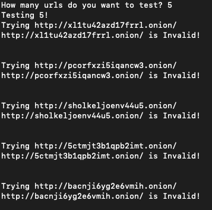

# .Onion Random Url Search script in python

## Versions / Libraries

Python Version 3.7.1
Tor Version 8.5

Request library is used to make network request through local tor proxy.
Pythons random library is also used to generate the url.

## Quick start

1. Install python 3.7.1

2. Install appropriate libraries

        pip install requests

**Note** pysocks might also be need for socket proxy

      pip install pysocks

3. Start Tor

Keep tor running in the back ground.

4. Run the python script

      python3 randomDotOnionSiteFinder.py

5. Enter the amount of random urls you want to generate and watch the code run.

 </img>
